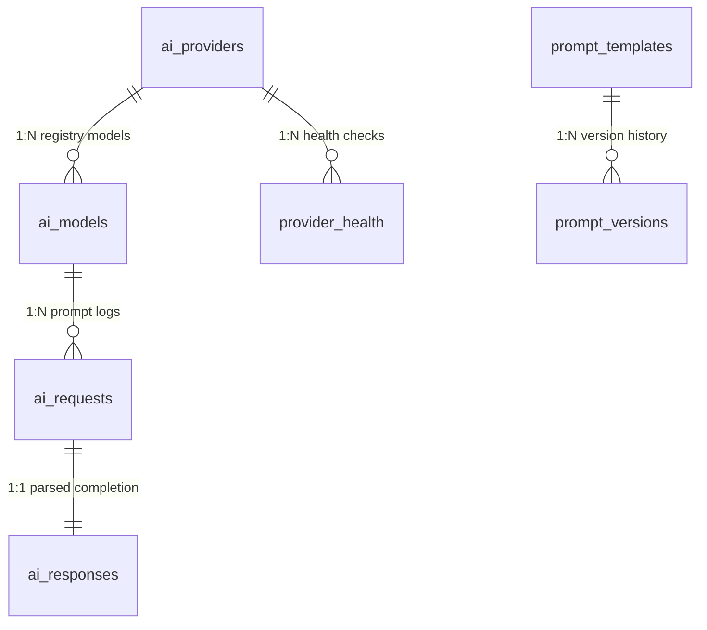

# AI Gateway & Model Management Platform Architecture

This document maps out the system components, routing engines, prompts rendering variables pipelines, and database relations implemented for the centralized Nexora AI Gateway.

---

## 1. Request Validation & Execution Pipeline
All outgoing AI prompts follow a unified nine-step security and validation lifecycle:

```
                  Client Request
                        │
                        ▼
   Authentication & Scopes Validation
                        │
                        ▼
   Intelligent Routing (Checks Health fallbacks or costs)
                        │
                        ▼
   Prompt variables interpolation (PromptRenderer values swap)
                        │
                        ▼
   Execute Chat/Stream provider completions
                        │
                        ▼
   Log Token usage, Estimated costs, and Latency checks
                        │
                        ▼
                Completed response
```

1. **Authentication & Scopes:** Resolves request user identity and active tenant organization.
2. **Quota Checks:** Asserts organization subscription state and rate limits usage quotas.
3. **Variable Injection:** Interjects template parameter flags (e.g. `{{clinic_name}}` -> `"Nexora Clinic"`) safely before packaging payload.
4. **Intelligent Router:** Dynamically routes payload based on capability checklist, cost limits, or health overrides.
5. **Gateway Provider:** Wraps connection pools for `OpenAI`, `Gemini`, `Anthropic`, or local `Ollama` models.
6. **Telemetry Ledger:** Updates cost stats, token records, and updates provider health checks database monitors.

---

## 2. Decoupled Provider Pattern
Nexora uses the **Strategy Pattern** to keep the core codebase decoupled from third-party vendor SDK packages (like `openai` or `google-generativeai`).

- **Interface:** `LlmProvider` defines standard `chat(...)` and `stream_chat(...)` signatures.
- **Provider Implementations:** Mapped under `OpenAiProvider`, `GeminiProvider`, `AnthropicProvider`, and `OllamaProvider`.
- **Mocks:** Sandboxed providers return realistic token usage logs and text completions during tests and development.

---

## 3. Database Entity Mappings (ORM)



---

## 4. Intelligent Routing Fallback Logic
The `AiGateway` service uses provider health check history to guard against cloud provider failures:
- **Health monitors:** The gateway tracks average failure rates for each provider.
- **Fallback swaps:** If a provider's failure rate exceeds 15%, requests are rerouted to a fallback model code (e.g. diverting sonnet calls to GPT-4o or local Ollama instances).

---

## 5. Folder Structure Mapping
```
backend/
├── app/
│   ├── api/
│   │   └── v1/
│   │       ├── deps.py (Added AI Gateway DI dependencies)
│   │       └── endpoints/
│   │           └── ai.py (Created endpoints)
│   ├── models/
│   │   └── ai_gateway.py (Created AI Gateway ORM models)
│   ├── repositories/
│   │   └── ai_gateway.py (Created Repositories)
│   ├── schemas/
│   │   └── ai_gateway.py (Created Pydantic v2 schemas)
│   └── services/
│       └── ai/
│           ├── providers.py (Created LLmProvider & OpenAI/Gemini/Ollama providers)
│           └── gateway.py (Created AiGateway & PromptRenderer helpers)
└── tests/
    └── integration/
        └── test_ai_gateway.py (Created integration tests)
```
