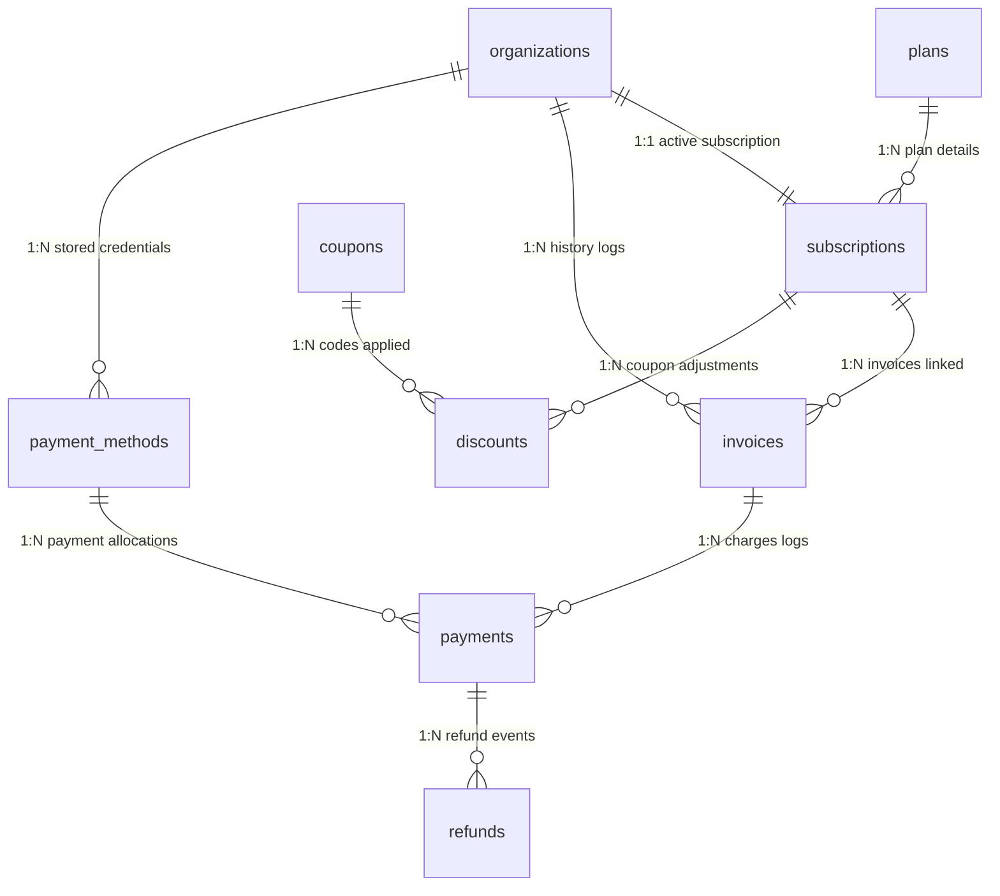

# Subscription & Billing Platform Architecture

This document maps out the entity relationships, lifecycle workflows, provider-independent payment abstractions, and usage validation patterns built for the Nexora Subscription & Billing system.

---

## 1. Billing Lifecycle Pipeline
Nexora supports standard SaaS subscription lifecycle transformations scoped by organization tenant:

```
 [ Free Trial ] ─────────► [ Trial Expires ]
       │                         │
       ▼                         ▼
 [ Checkout/Activate ] ──► [ Cancel Scheduled ] ──► [ Subscription Expired ]
       │                         ▲
       ▼                         │
 [ Upgrade/Downgrade ] ──────────┘
```

1. **Free Trial:** Handled upon organization registration if designated. Allocates starter quotas.
2. **Checkout/Activate:** Runs charges against payment credentials via the selected gateway provider, applies coupon percentage/fixed reductions, records paid invoices, updates Redis cache, and sets status to `"active"`.
3. **Upgrade/Downgrade:** Automatically calculates remaining prorated value, deletes old mappings, and updates pricing bounds.
4. **Cancellations:** Scheduled to set status to `"cancelled"` or schedule expiration at the end of the active monthly period, preserving access in the interim.

---

## 2. Payment Gateway Design Pattern
To shield application business services from direct dependencies on vendor-specific merchant libraries (like Stripe, JazzCash, or EasyPaisa APIs), we employ the **Strategy Pattern** behind an abstract interface:

```
                      ┌──────────────────────┐
                      │   PaymentGateway     │  (Abstract Interface)
                      └──────────┬───────────┘
                                 │
         ┌───────────────────────┼───────────────────────┐
         ▼                       ▼                       ▼
┌──────────────────┐   ┌──────────────────┐   ┌──────────────────┐
│  StripeProvider  │   │ JazzCashProvider │   │EasyPaisaProvider │
└──────────────────┘   └──────────────────┘   └──────────────────┘
```

The `BillingService` references the `PaymentGateway` interface exclusively. Adding new merchant gateways (e.g. PayPal, Paddle, or LemonSqueezy) requires declaring a new strategy provider subclass without altering active billing logic.

---

## 3. Database Entity Mappings (ORM)



---

## 4. Usage Quota Tracker Middleware
Quotas and feature flag checks run before any premium action (like sending AI messages, executing automated workflows, or calling voice APIs) using FastAPI dependency injects:

1. **Active Check:** Verifies subscription exists and holds status `"active"`, `"trialing"`, or `"grace_period"`.
2. **Boolean Flags:** Asserts specific tags (e.g. `voice_enabled`, `whatsapp_enabled`) are `True` inside the subscription plan features JSON.
3. **Numeric Thresholds:** Resolves target limit (e.g. `max_users`, `api_calls_limit`) and compares against records inside the `usage_records` table.
4. **Resets:** Cron scheduler scripts runs on database lines to reset consumed quantities monthly based on `usage_record.reset_at` bounds.

---

## 5. Folder Structure Mapping
```
backend/
├── app/
│   ├── api/
│   │   ├── usage.py (Created quota checks middleware)
│   │   └── v1/
│   │       ├── deps.py (Added Billing DI dependencies)
│   │       └── endpoints/
│   │           └── billing.py (Created endpoints)
│   ├── models/
│   │   └── billing.py (Expanded Plan/Sub, created Invoice/Payment/Usage)
│   ├── repositories/
│   │   └── billing.py (Created Repositories)
│   ├── schemas/
│   │   └── billing.py (Created Pydantic v2 schemas)
│   └── services/
│       └── billing/
│           ├── gateway.py (Created abstract interface & Stripe/JC/EP providers)
│           └── billing.py (Created BillingService)
└── tests/
    └── integration/
        └── test_billing.py (Created integration tests)
```
