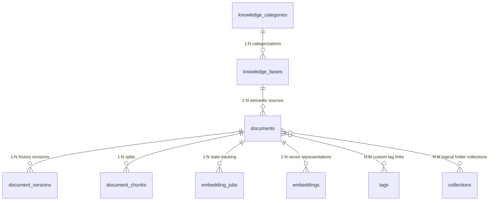

# Knowledge Base & Document Management Architecture

This document maps out the logical categories, ingestion workflow stages, storage strategies, and database schemas implemented for the Nexora Knowledge Base system.

---

## 1. Document Ingestion & Ingestion Pipeline
Uploaded document files follow a structured five-step lifecycle to build granular prompt context pools:

```
 [ Local file upload Form ] ────────► [ Storage Gateway provider writes ]
                                                      │
                                                      ▼
 [ ready splits text chunks ] ◄──────── [ Split text into chunks ]
             │
             ▼
 [ EmbeddingJob completion ] ─────────► [ Document Ready status ]
```

1. **Upload:** Client uploads a file payload. The system saves the file via the selected `StorageProvider` strategy, updates status to `"Uploading"`, and creates a version tracking record.
2. **Text Extraction:** Re-reads the file from storage and extracts string content using the `TextExtractor` module. Status swaps to `"Processing"`.
3. **Chunking Splitter:** Divides text into overlapping blocks matching custom config metrics (e.g. `chunk_size = 1000`, `overlap = 200`), preserving markdown boundaries. Inserts records into the `document_chunks` table.
4. **Queue Job:** Registers a pending job inside `embedding_jobs`, sets Document status to `"Embedding"`, and updates to `"Ready"` upon successful completion.

---

## 2. File Storage Strategy
All file writes decouple from cloud infrastructures by using a standard abstract strategy interface:

- **Interface:** `StorageProvider` defines signature uploads, downloads, and deletions.
- **LocalStorageProvider:** Stores documents inside the workspace subdirectory `./storage/` (sandboxed for offline testing).
- **S3StorageProvider:** Mock strategy simulating requests and resolving cloud URL strings.

---

## 3. Database Entity Mappings (ORM)



---

## 4. Scoping & Tenant Security Isolation
To enforce robust security:
1. **Org-ID bounds checks:** Every Document, Chunk, and Category record carries a mandatory `organization_id` foreign key.
2. **No global path leakage:** File storage keys prefix with `org_{organization_id}` to prevent directory traversals.
3. **Protected reads:** API routing layers enforce active tenant bounds checks on Document identifiers (`get_by_id_scoped`), blocking unauthorized downloads.

---

## 5. Folder Structure Mapping
```
backend/
├── app/
│   ├── api/
│   │   └── v1/
│   │       ├── deps.py (Added Knowledge DI dependencies)
│   │       └── endpoints/
│   │           └── knowledge.py (Created endpoints)
│   ├── models/
│   │   └── knowledge.py (Expanded KB/Document, created Categories/Versions/Chunks/Tags/Collections)
│   ├── repositories/
│   │   └── knowledge.py (Created Repositories)
│   ├── schemas/
│   │   └── knowledge.py (Created Pydantic v2 schemas)
│   └── services/
│       ├── storage/
│       │   └── provider.py (Created StorageProvider & Local/S3 providers)
│       └── knowledge.py (Created Extraction/Splitting helpers & Services)
└── tests/
    └── integration/
        └── test_knowledge.py (Created integration tests)
```
