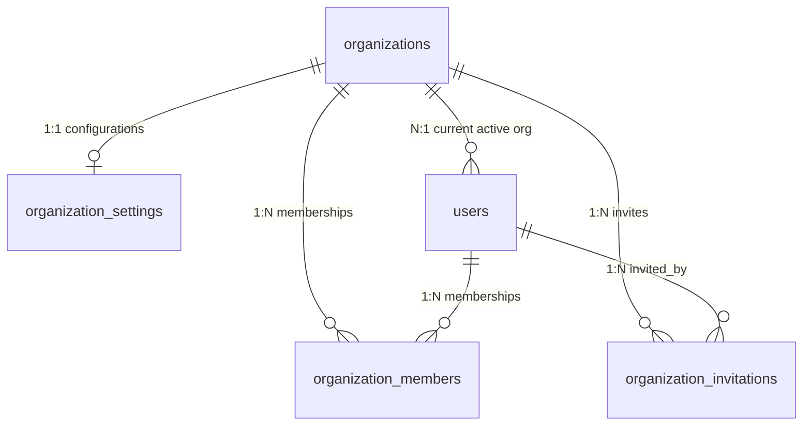

# Organization Service & Multi-Tenant Architecture

This document details the multi-tenant architecture, data isolation mechanisms, database relationships, and security models implemented for the Nexora Organization Service.

---

## 1. Multi-Tenant Strategy
Nexora employs a **shared database, shared schema** multi-tenant architecture with logical data partitioning at the application layer. This provides high resource efficiency and simplified maintenance while ensuring strict data separation boundaries.

### Scoping & Filtering
- Every tenant record contains an `organization_id` foreign key.
- **Tenant Context Resolution:** Frontend clients never supply raw `organization_id` parameters in API headers. Instead, when a user authenticates, their active tenant ID is loaded from the `users.organization_id` column.
- **Access Guard Dependency:** The dependency `get_current_organization` resolves the active tenant. It verifies that the authenticated user holds a valid mapping in the `organization_members` database table for that organization before granting access to resources.

```
                  ┌──────────────────────┐
                  │   Client Request     │
                  └──────────┬───────────┘
                             │ JWT Token
                             ▼
                  ┌──────────────────────┐
                  │   get_current_user   │
                  └──────────┬───────────┘
                             │ Resolve User Object
                             ▼
                  ┌─────────────────────────────┐
                  │  get_current_organization   │
                  │                             │
                  │ Verify user.organization_id │
                  │ membership in DB mapping    │
                  └──────────┬──────────────────┘
                             │ Resolve Tenant Context
                             ▼
                  ┌──────────────────────┐
                  │   Scoped DB Query    │
                  │                      │
                  │   WHERE tenant_id =  │
                  │   resolved_org_id    │
                  └──────────────────────┘
```

---

## 2. Database Relationships (ORM Mappings)



### SQLAlchemy Mapped Declarations
1. **Organization (`organizations`):** The primary tenant. Owns its settings card, teammates list, billing tier, and configurations.
2. **OrganizationSettings (`organization_settings`):** Mapped `1:1` to organizations, storing custom themes, brand colors, working days, active languages, and custom domain names.
3. **OrganizationMember (`organization_members`):** Association table implementing many-to-many relationship mapping between Users and Organizations, adding an explicit `role` column (owner, admin, manager, employee, receptionist, doctor).
4. **OrganizationInvitation (`organization_invitations`):** Stores invite tokens, expiration timestamps, status, and role metadata for self-serve team onboarding.

---

## 3. Security Model (Mitigating Vulnerabilities)
To protect against common tenant vulnerabilities:
- **Preventing IDOR / Tenant Spoofing:** Endpoints never filter data based on organization IDs passed in from the client. All queries filter using the verified `active_org.id` from `Depends(get_current_organization)`.
- **Horizontal Privilege Escalation:** Attempting to switch active workspaces via `/organizations/switch` validates that the user holds a record in the `organization_members` table for the target workspace. If not found, it throws a `401 Unauthorized` exception.
- **Tenant Enumeration Protection:** UUID v4 primary keys are utilized across all tenant tables, preventing sequential numeric enumeration attacks.

---

## 4. API Design Specifications
The API routes are designed under standard REST guidelines:
- `POST /organizations`: Register a new organization tenant.
- `GET /organizations/me`: Retrieve profile details of the active workspace.
- `PUT /organizations`: Update organization metadata.
- `DELETE /organizations`: Soft delete organization (Owner only).
- `GET /organizations/settings`: Fetch brand config cards.
- `PUT /organizations/settings`: Update settings.
- `GET /organizations/members`: Get list of organization members.
- `POST /organizations/invite`: Send teammate invite token.
- `POST /organizations/switch`: Switch active organization session.
- `GET /organizations/activity`: Pull active audit activity log feed.

---

## 5. Folder Structure Mapping
The new module is mapped directly within the established project structure:
```
backend/
├── app/
│   ├── api/
│   │   └── v1/
│   │       ├── deps.py (Added current org dependency)
│   │       └── endpoints/
│   │           └── organizations.py (Created endpoints)
│   ├── models/
│   │   ├── config.py (Expanded Org, created Settings, Members, Invites)
│   │   └── user.py (Linked memberships relationship)
│   ├── repositories/
│   │   └── organization.py (Created Repositories)
│   ├── schemas/
│   │   └── organization.py (Created Pydantic v2 schemas)
│   └── services/
│       └── organization.py (Created OrganizationService)
└── tests/
    └── integration/
        └── test_organization.py (Created integration tests)
```

---

## 6. Scalability Strategy
As volume increases, this logical multi-tenant layout is structured to support physical partitioning:
- **Database Partitioning:** PostgreSQL declarative partitioning can partition table rows by `organization_id` value blocks.
- **Physical Isolation:** When customers upgrade to enterprise plans, their tenant databases can be easily isolated to separate PostgreSQL servers by altering the database routing layer to map their unique `organization_id` to a target connection string dynamically.
