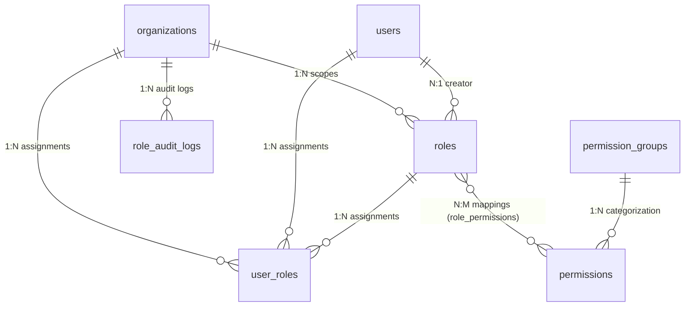

# Role Based Access Control (RBAC) Architecture

This document outlines the architecture, data structures, caching strategy, and validation flows implemented for the Nexora Role Based Access Control (RBAC) system.

---

## 1. Permission Resolution Flow
When an authenticated user requests access to an API endpoint protected by a security dependency (e.g. `RequirePermission("knowledge.create")`), the validation follows a strict five-step hierarchy to resolve their authorization state:

```
    User Request
         │
         ▼
   Authentication (Resolves user identity)
         │
         ▼
   Organization Validation (Resolves active tenant context)
         │
         ▼
   Role Resolution (Checks assignments in user_roles table)
         │
         ▼
   Permission Resolution (Checks loaded strings or checks Owner status)
         │
         ▼
   Access Granted / Denied
```

### Owner Bypass (Super-User)
- If the authenticated user's ID matches the `owner_id` column of the active `Organization` table, the check automatically bypasses database/caching checks and returns `True`, ensuring that organization owners can never lock themselves out of vital settings.

---

## 2. Database Relationships (ORM Mappings)



1. **Role (`roles`):** Holds names, slugs, priorities, and organization mappings. A role is system-wide if `is_system` is `True` and `organization_id` is null, or custom if created per tenant.
2. **Permission (`permissions`):** Holds granular permissions codes (e.g. `users.create`, `chat.reply`). Categorized under `PermissionGroup` modules.
3. **UserRole (`user_roles`):** Association model representing explicit role allocations to users per organization. Supports dynamic attributes (e.g. `expires_at` for temporary access, `status` tracking).
4. **RoleAuditLog (`role_audit_logs`):** Security ledger recording role allocations, revocations, and customizations.

---

## 3. Caching Strategy
To achieve high performance capable of handling millions of authorization evaluations, permissions are cached in Redis:

- **Key Schema:** `user:permissions:{user_id}:{organization_id}`
- **Data Structure:** JSON array of permission codes (e.g. `["users.read", "chat.reply"]`).
- **TTL (Time to Live):** 1 hour (3600 seconds).
- **Cache Invalidation:** The cache is deleted immediately on any mutation to the user's role assignments (`assign_role`, `remove_role`) or when modifications are saved to a custom role (`update_custom_role`), ensuring real-time authorization synchronization.

---

## 4. API Design Specifications
The API routes are designed under standard REST guidelines:
- `GET /roles`: List all custom + system roles.
- `POST /roles`: Create a custom tenant role (enforces `RequireAdmin()`).
- `PUT /roles/{id}`: Modify custom role details (enforces `RequireAdmin()`).
- `DELETE /roles/{id}`: Soft delete custom role (enforces `RequireAdmin()`).
- `GET /permissions`: List all system permission nodes.
- `POST /roles/assign`: Assign role mapping to user (enforces `RequireAdmin()`).
- `POST /roles/remove`: Unlink user assignment (enforces `RequireAdmin()`).
- `GET /users/{id}/permissions`: Fetch active permissions list for user.

---

## 5. Folder Structure Mapping
The new module is mapped directly within the established project structure:
```
backend/
├── app/
│   ├── api/
│   │   ├── authorization.py (Created decorators/dependencies)
│   │   └── v1/
│   │       ├── deps.py (Added RBAC dependencies)
│   │       └── endpoints/
│   │           ├── rbac.py (Created endpoints)
│   │           └── organizations.py (Integrated auto-seeding hook)
│   ├── models/
│   │   └── user.py (Refactored Role/Permission, created UserRole/Group/Audit)
│   ├── repositories/
│   │   └── rbac.py (Created Repositories)
│   ├── schemas/
│   │   └── rbac.py (Created Pydantic v2 schemas)
│   └── services/
│       └── rbac.py (Created RBACService)
└── tests/
    └── integration/
        └── test_rbac.py (Created integration tests)
```
