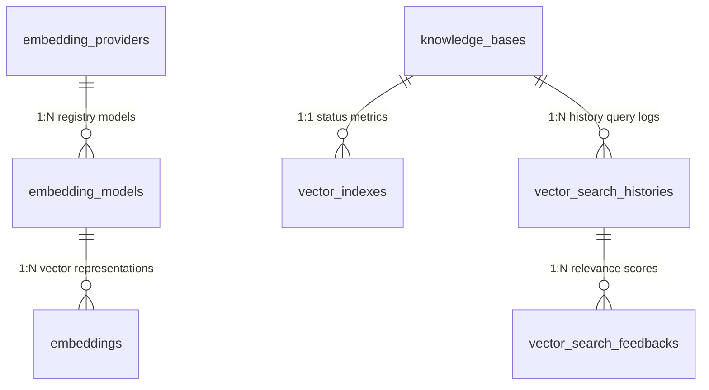

# Vector Database & Semantic Search Architecture

This document maps out the system components, pgvector query planners, Reciprocal Rank Fusion (RRF) search merger, and multi-tenant security strategies implemented for the Nexora Vector Database infrastructure.

---

## 1. Hybrid Search & RRF Pipeline
Outgoing queries run through a parallel keyword + vector retrieval layout to gather context chunks:

```
                          Search Query
                                │
                ┌───────────────┴───────────────┐
                ▼                               ▼
       Keyword Query scan               pgvector Cosine scan
       (ILIKE / FTS chunks)             (Cosine Distance check)
                │                               │
                └───────────────┬───────────────┘
                                ▼
               Reciprocal Rank Fusion Score (RRF)
               Score = sum( 1 / (60 + rank) )
                                │
                                ▼
                       Top K fused results
```

1. **Semantic Vector Match:** Checks Cosine similarity on `embeddings.vector_embedding` using pgvector query metrics, returning Top 10 matches.
2. **Keyword Scan:** Checks query matching on `document_chunks.content` using text scans, returning Top 10 matches.
3. **Score Normalization & Fusion:** Evaluates RRF calculations on chunk IDs, ranking documents dynamically based on combined matches.
4. **Recall Telemetry:** Traces query latency, records search history, and tracks user ratings relevance feedback.

---

## 2. Indexing Strategy
To scale semantic searches to millions of vectors, we implement two primary indexes:

- **HNSW (Hierarchical Navigable Small World):** Highly accurate graph search, optimized for high recall rates (configured default for core clinics search).
- **IVFFlat:** Inverted file index with cluster centroids, optimized for minimal memory usage.
- **Background indexing:** Building or rebuilding indexes executes in asynchronous asyncio pipelines, preventing query latency spikes on active nodes.

---

## 3. Database Entity Mappings (ORM)



---

## 4. Multi-Tenant Bounds Security
To safeguard organizational data:
1. **Join Constraints:** Vector query statements enforce an active `organization_id` foreign key verification on parent `documents` and `document_chunks` records.
2. **Explicit isolation:** Embeddings searches check for tenant bounds matching `Embedding.organization_id == organization_id`.
3. **Feedback Protection:** Ratings search history logs filter queries by current active organization.

---

## 5. Folder Structure Mapping
```
backend/
├── app/
│   ├── api/
│   │   └── v1/
│   │       ├── deps.py (Added Vector DI dependencies)
│   │       └── endpoints/
│   │           └── vector.py (Created endpoints)
│   ├── models/
│   │   ├── knowledge.py (Refactored Embedding to link chunk/model IDs)
│   │   └── vector.py (Created Vector ORM models)
│   ├── repositories/
│   │   └── vector.py (Created Repositories)
│   ├── schemas/
│   │   └── vector.py (Created Pydantic v2 schemas)
│   └── services/
│       └── vector.py (Created VectorService with pgvector & RRF search)
└── tests/
    └── integration/
        └── test_vector.py (Created integration tests)
```
